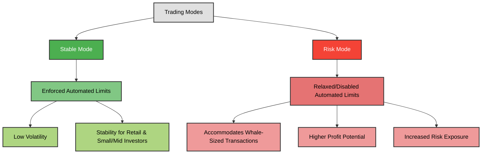
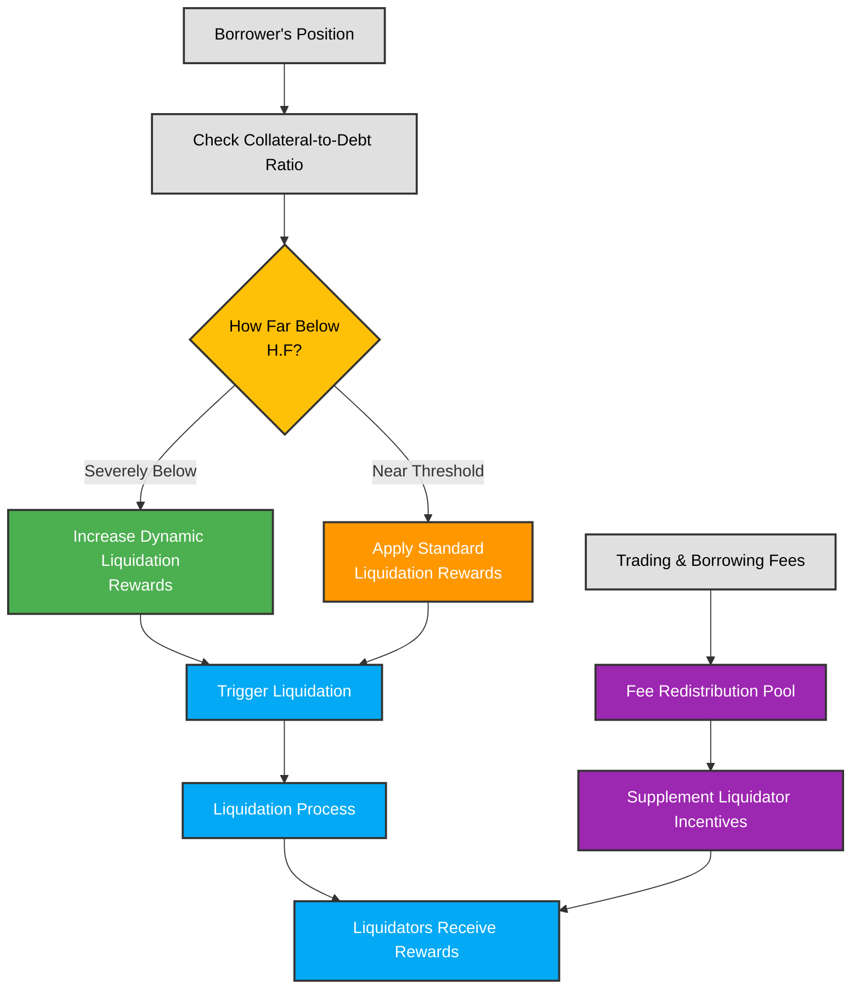
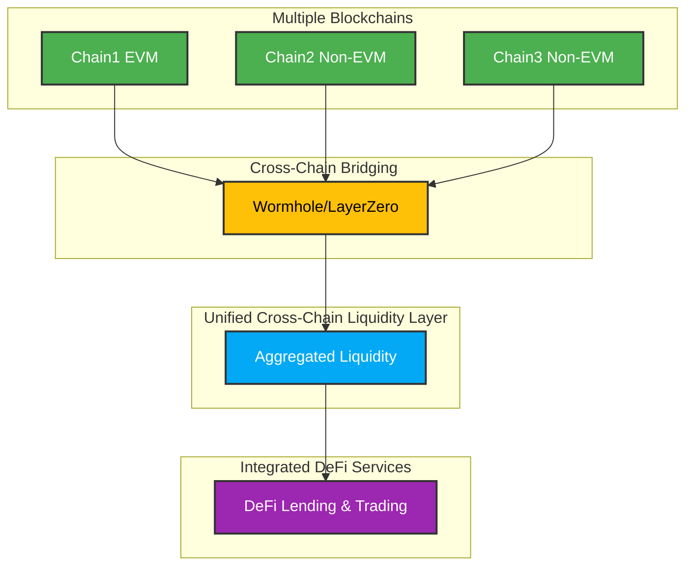
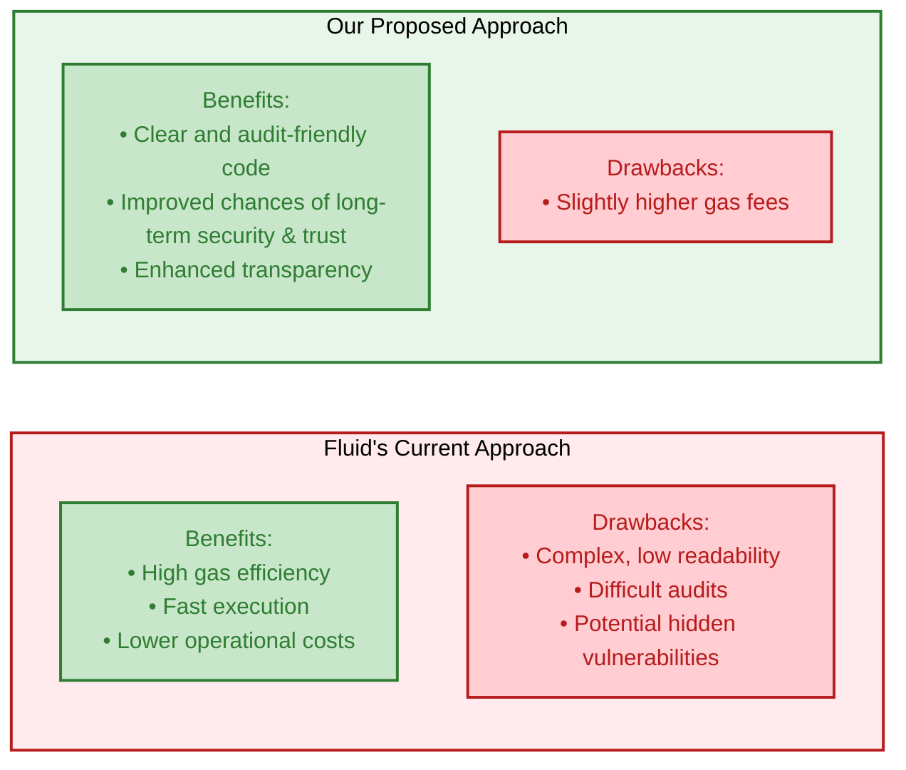

# Instadapp Fluid (FLUID) Research


## 1. Introduction  
Instadapp Fluid (FLUID) is a suite of smart contracts designed to streamline advanced DeFi operations within the Instadapp ecosystem. By unifying lending, vault management, and decentralized trading under a single liquidity layer, Fluid optimizes capital usage, reduces transaction costs, and enhances overall efficiency.

---

## 2. System Overview  
At the heart of Instadapp Fluid is a **unified liquidity layer** that serves multiple protocols:
- **Lending Protocol** – Users supply liquidity and earn interest through fTokens.
- **Vault Protocol** – Users borrow against collateral (e.g., ETH) with high loan-to-value (LTV) ratios.
- **Additional Modules** – Includes flashloans, stETH, and a DEX module for trading.


source : https://twitter.com/0xfluid/status/1820485781888323689

---

## 3. Architecture  
Fluid’s architecture revolves around a single liquidity framework that connects its core components. This diagram (based on the provided illustration) outlines the system:

```
              +----------------------+
              |  Additional Modules  |
              |  (Flashloan, stETH,  |
              |       DEX, etc.)     |
              +-----------^----------+
                          |
                          v
        +---------+    Unified       +---------+
        | Lending | <- Liquidity ->  |  Vault  |
        |Protocol |    Layer         |Protocol |
        +---------+                  +---------+
```

*The unified liquidity layer feeds into every module, ensuring that assets are used efficiently across lending, borrowing, and trading activities.*

---

## 4. Essential Concepts

- **Liquidity:**  
  The total pool of assets available for lending, borrowing, or trading.

- **Vault:**  
  A secure smart contract that manages users’ collateral and debt positions.

- **Flashloan:**  
  A short-term loan that is borrowed and repaid within a single transaction, with no upfront collateral required.

- **fTokens:**  
  Tokens issued when users deposit assets into the liquidity layer, representing their stake and accruing interest over time.

- **Oracle:**  
  A service that provides reliable, real-time price data for assets. Fluid uses TWAPs (Time-Weighted Average Prices) from sources like Uniswap and Chainlink to ensure accurate pricing.

- **TWAP (Time-Weighted Average Price):**  
  A method of calculating the average price of an asset over a set period, which helps reduce the impact of short-term price fluctuations and manipulation.

- **Ticks:**  
  Discrete intervals or "buckets" that group user positions based on their debt-to-collateral ratios. For example, a position's "tick" is determined by a formula (such as `ratio = 1.0015^t`), which places similar risk profiles together for more efficient processing.

- **Branches:**  
  Structures used during the liquidation process to track groups of liquidated positions. A branch records the state of a range of ticks, enabling batch processing of liquidations without interacting with individual positions directly.

- **Smart Debt:**  
  A feature that automatically turns borrowed assets into productive liquidity, allowing users to earn trading fees and interest that help offset borrowing costs—integrated directly into Fluid’s protocol for higher efficiency.

- **95% LTV (Loan-to-Value):**  
  This means a borrower can borrow up to 95% of the value of their collateral. For example, if you have collateral worth $100, you can borrow up to $95. This high ratio maximizes borrowing capacity but leaves only a small margin to cover market downturns.


---

## 5. Features & Mechanics

### Unified Liquidity Layer  
Fluid consolidates capital into one pool that supports multiple functionalities—lending, vault operations, and trading. This approach minimizes liquidity fragmentation and maximizes capital efficiency.

### Advanced Lending & Borrowing  
- **Deposits & fTokens:** Users deposit assets (e.g., USDC) into the liquidity layer and receive fTokens, which accrue interest over time.
- **Collateralized Borrowing:** Users can use assets like ETH as collateral to borrow funds with LTV ratios of up to 95%, enabling high borrowing capacity with controlled liquidation risk.
### High LTV Loans 
Fluid provides loans upto 95% Loan-to-value ratio which is the highest of all. A 95% LTV (Loan-to-Value) loan means that a borrower can borrow up to 95% of the value of their collateral. For example, if you have $100 worth of collateral, you can borrow up to $95

### Integrated DEX  
The DEX module leverages smart collateral and debt management to facilitate efficient trading, allowing users to optimize positions and earn liquidity provider fees—all within the unified system.

### Smart Debt
Fluid introduces **Smart Debt**, a feature that transforms borrowed assets into productive liquidity within its Decentralized Exchange (DEX) protocol. By allocating debt as trading liquidity, users can earn trading fees, effectively offsetting borrowing costs and enhancing capital efficiency.
**Key Benefits:**
- **Cost Reduction:** Trading fees earned from providing debt as liquidity can offset interest expenses, reducing the overall cost of borrowing.
- **Capital Efficiency:** This mechanism allows users to maximize the utility of their borrowed assets, turning liabilities into income-generating assets.

### Range liquidations
In traditional borrow and lending protocols, liquidation is like a limit order and highly inefficient,where liquidator selects each position to liquidate. Vault protocol revolutionizes liquidations similar to how Uniswap v3 has revolutionized limit orders. Allowing all the positions in range to get liquidated without any increase in gas.

### Advanced Oracles Management
The Vault protocol uses an advanced oracle system that combines Uniswap's TWAP checkpoints with Chainlink's feeds to deliver accurate, real-time pricing data. This multi-source approach ensures asset values are reliably determined and cross-verified, minimizing the risk of price manipulation and enabling timely liquidation of bad debt. As a result, the protocol enhances security and supports higher LTV ratios, providing users with a more transparent and trustworthy borrowing experience.


---

## 6. How Fluid Works

### Liquidity Provision  
Users deposit assets into the unified liquidity layer and receive fTokens. These fTokens represent their stake and accrue interest via the Lending Protocol.

### Collateralized Borrowing  
Depositing assets such as ETH into the Vault Protocol allows users to borrow against their collateral. A specialized Vault Resolver monitors positions to manage risk and prevent sudden liquidations.

### Decentralized Trading & Fee Generation  
The integrated DEX facilitates cost-effective trades by combining smart collateral and debt management. This not only optimizes trade execution but also allows users to earn fees as liquidity providers.

### Governance
- **Governance Token:** INST is the governance token for Fluid, empowering holders to shape the protocol.
- **Key Responsibilities:**
  - Set rate curves, fees, and token configurations within the liquidity layer.
  - Configure protocol settings and establish allowances for interactions with the liquidity layer.
  - Establish automated limits and classify protocols.
  - Set up Vault configurations.
  - Determine reward structures for both the Lending and Vault protocols.
---

## 7. The Vision  
Fluid aspires to build a sustainable, interoperable liquidity infrastructure that drives capital optimization and cost-effective transactions across the DeFi landscape.

---

## 8. Use Cases

### 8.1 Use Cases for the FLUID Token  
- **Transaction Fees:** FLUID tokens are used to pay fees within the ecosystem, ensuring smooth operations.  
- **Governance:** Token holders can participate in governance decisions that shape the protocol’s future.  
- **Incentives & Rewards:** Users earn FLUID tokens by contributing liquidity, staking assets, or engaging in protocol activities.

### 8.2 Use Cases for the Fluid Protocol  
- **Lending & Borrowing:** Provides mechanisms for earning interest through deposits and accessing loans with high LTV ratios.  
- **Decentralized Trading:** Integrated DEX enables efficient trading with minimal slippage and competitive fee structures.

---

## 9. Financial Snapshot (Data from DeFi Llama)  
- **Total Value Locked (TVL):** $793.54M  
- **Market Cap:** $199.51M  
- **Token Price:** $5.05  
- **24h Token Volume:** $1.52M  
- **Borrowed Amount:** $665.75M  
- **Annualized Fees:** $91.8M  
- **Annualized Revenue:** $3.86M

---

## 10. Pros & Cons

### Pros

- **Lower liquidation Penalty**
  Vault protocol users lose only 5% of their collateral ( liquidate what's needed ) as compared to 50% or 100% on other lending/borrow protocols.

- **High Capital Efficiency:**  
  The unified liquidity layer optimizes asset utilization across multiple functions.

- **Advanced Lending & Borrowing:**  
  Attractive features like high LTV ratios and interest-bearing fTokens benefit both lenders and borrowers.

- **Minimal Liquidation Penalties:**
    Fluid's Vault protocol offers exceptionally low liquidation penalties, starting from as low as 0.1%, compared to the typical 5-10%
    in other DeFi platforms. This significantly reduces the financial burden on borrowers during liquidation events, preserving more of their collateral.

- **Seamless Trading Integration:**  
  The integrated DEX allows efficient trading and fee generation within the same ecosystem.

### Cons
- **Automated Limits: Impact on Large Whale Transactions**
  Automated limits are implemented to protect the protocol by dynamically adjusting borrowing and liquidity ceilings. However, they can sometimes throttle large
  transactions causing delays or partial fills—even when market conditions are stable, which may frustrate users with high-volume activity.

- **Reduced Incentives for Liquidators:** The lower liquidation penalties in Fluid may diminish the financial motivation for liquidators, potentially affecting their participation and the overall efficiency of the liquidation process.

- **High LTV Risks:**  
  While high LTV ratios provide borrowing capacity, they also increase exposure to market volatility and the risk of rapid liquidations.

- **Limited Cross-Chain Fragmentation Solution**  
  Although Fluid aims to address chain fragmentation by unifying liquidity, its current implementation is limited to EVM-compatible networks—specifically Ethereum,
  Arbitrum, Base, and Polygon. This focus means that while Fluid streamlines operations within the EVM ecosystem, it doesn't fully resolve fragmentation across non-EVM
  chains. Consequently, users and assets on other blockchains remain excluded, limiting overall interoperability and network diversity.

## 11. Security Partners
Instadapp takes security seriously that's why it partners with good & exceptional security partners like 

- Cantina
- MixBytes
- StateMind

of which Cantina is clearly is leading the way for security audits.
See the [Audit reports Here](https://docs.fluid.instadapp.io/audits-and-security.html)

## 12. Future insights
With the release of uniswap V4 , and the features it gives like hooks and inverse-range-orders , Fluid's founder has shared a vision of going completely oracleless in his [article](https://blog.instadapp.io/oracleless-lending-protocol-on-uniswap-v4/).

## 13. Developer Kickstarter
This section will take deep dives in to the technical side of things to help developers better understand the protocol when they want to integrate with it.

### How Vault Liquidation Mechanism Works

The Vault protocol’s liquidation mechanism is a significant innovation inspired by Uniswap v3, yet it delivers performance improvements up to 100x over traditional systems. When a user opens a position, the protocol assigns it to a specific tick based on the user's debt-to-collateral ratio. This tick is calculated using the formula `ratio = 1.0015^t` (with `t` representing the tick), effectively grouping positions into discrete liquidity buckets. This design consolidates user liquidity and streamlines liquidations, making the process resemble a simple swap operation. To optimize gas efficiency, Fluid employs a custom **TickMath library**—inspired by Uniswap v3—that allows for fast and accurate computation of tick values from given ratios, significantly reducing on-chain computational overhead.

i.e userSupplyData is stored [like this](https://github.com/Instadapp/fluid-contracts-public/blob/499e1ab40581fa71e71a934f2820d8385f1e1878/contracts/liquidity/common/variables.sol#L146-L159)

#### Branch and User's Tick Retrieval

When a liquidation event occurs, the protocol must retrieve the user's position in real time. Fluid achieves this through a branch-based mechanism where a "branch" captures the state of liquidation-related variables. The user's pre-liquidation tick serves as the starting point, establishing the debt factor and linking to a branch. As the system iterates through the branch, it identifies the minimum tick (minima) and calculates the total liquidation impact. This approach enables efficient, precise liquidation even for users with multiple past liquidations. As market conditions change—new users entering at higher ticks when prices rise, and higher ticks being liquidated when prices fall—a branch remains active until it reaches the base branch's minima, at which point it merges with the base branch to continue the liquidation process seamlessly.

For a more detailed mathematical explanation, refer to [Fluid's Vault Whitepaper](https://1779047404-files.gitbook.io/~/files/v0/b/gitbook-x-prod.appspot.com/o/spaces%2F1GnplQv2H5lIIg0ygng0%2Fuploads%2FXhmUuTV7RpeVnPpadddp%2FVault_Protocol_Whitepaper_.pdf?alt=media&token=1509f8b8-dd0d-4da3-b765-f9188d9fc1dd).

#### Some Observations :

1. there are no liquidations in the userModule/ of the liquidity layer. The management of liquidatable positions is handled by the underlying protocols. The liquidity layer is solely responsible for tracking debt, supply, and oracle prices.
2. user supply data and borrow data are stored in a unique compact way https://github.com/Instadapp/fluid-contracts-public/blob/499e1ab40581fa71e71a934f2820d8385f1e1878/contracts/liquidity/common/variables.sol#L163-L177

... To be continued

## Questions & Answers


### smart debt - allows debt to be re-provided as liquidity offsetting the borrow costs . but how it's different than leveraging a solidity contract  and loaning token2 on dex1 for token 1 as collateral , then selling this token2 on dex1 and getting the token1 and then repeating the same process in a loop based function call of this smart contract

answer :
Smart debt in Fluid is more than just reusing debt as collateral to offset borrowing costs—it’s an integrated mechanism that converts your debt into productive liquidity that earns both transaction fees and interest, all within a gas-efficient, automated risk management framework.

Unlike manually looping a Solidity contract to repeatedly borrow, swap, and reinvest (which primarily targets arbitrage profits), smart debt is built into Fluid’s core, leveraging optimized libraries and automated controls to reduce gas fees and exposure to market risks. This native integration not only simplifies the process for users by handling debt conversion internally but also ensures that all benefits—such as fee accrual, interest earnings, and great risk management are fully realized, delivering superior overall capital efficiency.

- passive management
- gas efficiency
- transactions minimzation 
- security


### why fluid competes for uniswap when it  uses twaps of uniswap to decide asset prices ( or if not asset prices then what ) because for some pools , fluid has higher volume for even their counterpart uniswap pools . then why use uniswap twap in the first place . Why not it's own pool data for deciding the twap data.Also  , if fluid continues to  use uniswap , it can never beat it because the twap is from uniswap . Or if it intends to beat it as a  dex, how exactly does that go?

answer : Fluid leverages Uniswap’s TWAP as a battle-tested & trusted price benchmark because of its deep liquidity and broad participation in the ecosystem. Fluid' competitive edge lies not in reinventing price discovery ( even though at times , it has the highest volume for some pairs ), but the edge  lies in building an integrated ecosystem that combines efficient lending, vault management, and trading — with innovative features like smart debt and gas-optimized liquidations — that delivers superior capital efficiency and user experience beyond mere price feeds.

### Bad debt since fluid provides almost 95% of ltv , there is always a possibility of accruing bad debt. what i think is vault resolvers are not much different than high performance arbitragers . what are the mechanisms that you guys employ to eliminate the risk of bad debt ( if you eliminate it ) or you accept the scenario of bad debts and have some kind of treasury to fill debt from in the event position defaults ?

100$ eth 
95$ usdt 

after some time
80$  
95$
bad debt 15$ - ptorocol

liquidate() call


answer :

Vault implements a highly efficient liquidation mechanism that prevents individual position liquidations by consolidating them into groups (ticks),
significantly reducing the risk of bad debts in volatile market conditions. Additionally, the protocol incorporates a bad debt absorption feature,
ensuring that liquidations are not unprofitable for the liquidator.

#### How liquidation work ?

answer :

check this huge [`liquidate()`](https://github.com/Instadapp/fluid-contracts-public/blob/499e1ab40581fa71e71a934f2820d8385f1e1878/contracts/protocols/vault/vaultT1/coreModule/main.sol#L583C5-L1248C1) method inside VaultT1 contract's core module.

how liquidations happen :

In Fluid, liquidations are performed by operating on aggregated data rather than modifying each user’s position individually.

Here’s how it works:

- Positions Organized into Ticks
  Each user’s position is stored as an NFT that includes a "tick" value, which reflects the position's collateral-to-debt ratio. Positions with similar ratios are grouped into the same tick.

- Batch Liquidation with Branches
  When conditions trigger a liquidation (for example, if collateral prices drop), Fluid doesn’t go in and adjust each individual position. Instead, it works at the tick level—processing all positions within a tick as a single group. A branch mechanism is used to track and adjust the state of these ticks, effectively "moving" the entire group to a safer range without directly touching each NFT.

- Efficient Rebalancing

  By relying on pre-calculated tick data (using a specialized TickMath library), the protocol can update the overall debt and collateral figures for each tick. This approach rebalances the positions efficiently and minimizes gas costs.


### how fluid determine exchange price of assets  ( more deep ) ?

inside admin module 

https://github.com/Instadapp/fluid-contracts-public/blob/a4e6897c00c45adf7adf9d3261723301c2dc0a7e/contracts/liquidity/adminModule/main.sol#L1203-L1219

initially it's governance that will call this function and set intial params.

```solidity
    function updateExchangePrices(
        address[] calldata tokens_
    ) external returns (uint256[] memory supplyExchangePrices_, uint256[] memory borrowExchangePrices_) {
        uint256 tokensLength_ = tokens_.length;

        supplyExchangePrices_ = new uint256[](tokensLength_);
        borrowExchangePrices_ = new uint256[](tokensLength_);

        for (uint256 i; i < tokensLength_; ) {
            _checkIsContractOrNativeAddress(tokens_[i]);
            (supplyExchangePrices_[i], borrowExchangePrices_[i]) = _updateExchangePricesAndRates(tokens_[i]);

            unchecked {
                ++i;
            }
        }
    }

```

if changes are substantial due to `_supplyOrWithdraw` or `_borrowOrPayback` functionalities called conditionally inside `operate` method

the protocol updates

- exchange prices
- utilization ( the percentage of assets that have been borrowed out of the total assets available in the protocol's liquidity pool )
- ratios

For minor changes, only the `supplyExchangePrice` and `borrowExchangePrice` are updated 

### what is the center price in fluid dex dashboard 

The center price is the mid-market price around which liquidity is concentrated. It’s calculated using reliable price feeds like Uniswap TWAPs and Chainlink, and it serves as a key benchmark for the protocol. This center price is important because it anchors liquidity ranges (or ticks), enabling the system to:

- Dynamically adjust liquidity allocation  
- Reduce slippage during trades  
- Maintain efficient pricing

By this stable reference point, Fluid makes sure that trading and liquidity management are both optimized and resilient to market conditions.


## What Fluid's rival can do ?

While still using the best features from Fluid like aggregated liquidations , manipulation-resistant oracles, smart debt & collateral, here's what a rival can do 
to have an improved system than Fluid in my opinion.

### 1. Prudent LTV Ratios
Using a lower LTV—say, 85% to 90%—can indeed reduce liquidation risk by providing a larger safety margin. High LTV ratios can serve as double-edge sword. While a 95% LTV maximizes borrowing capacity, it leaves little room for market fluctuations and can trigger rapid liquidations in volatile conditions. By lowering the LTV, you sacrifice some capital efficiency in exchange for increased resilience against price drops, which can be a prudent design choice if you prioritize stability and risk management.

### 2. Risk Based Trading modes ( wgat parameters get changed in automated limits )
You could design your system with two market modes:

- **Stable Mode:** Enforces automated limits to protect retail and small-to-mid investors by ensuring stability and minimizing volatility.
- **Risk Mode:** Relaxes or disables automated limits to accommodate whale-sized transactions, offering higher profit potential at increased risk.


This dual approach lets you tailor risk and reward for different investor segments, similar to Aave's efficiency mode ( if i'm correct ) .

### 3. Sustainable Liquidation Incentive Model: Dynamic Rewards & Fee Redistribution
A sustainable approach would combine dynamic liquidation rewards with a fee redistribution mechanism. For example:


- **Dynamic Liquidation Rewards:**  
  The system can automatically increase liquidation incentives when a borrower’s collateral-to-debt ratio falls severely below safe levels. This means that in riskier situations, liquidators are rewarded more generously to ensure rapid and efficient resolution of bad debt.

- **Fee Redistribution Mechanism:**  
  Instead of burdening borrowers with high liquidation penalties, a portion of fees collected from trading or borrowing activities can be allocated to a dedicated reward pool. This pool then funds the higher incentives for liquidators, ensuring that the extra rewards come from protocol fees rather than additional charges on borrowers.


This dual strategy encourages liquidators to act swiftly during high-risk periods while keeping the costs for borrowers minimal, ultimately maintaining a balanced, sustainable system.

### 4. Solving the true liquidity-fragmentation problem
You can use a mix of service like `wormhole` and `layerzero` to support almost any chain , build a new liquidity layer that incorporate other chain's assets as well
and then you can truly solve the liquidity fragmentation problem by leading the unified crosschain liquidity industry instead of only being EVM focused like Fluid.

Something like this


Additionally you should check `Euclid` which is already aiming to `provide liquidity to every chain`.


### 5. Trade code readability for gas - ensure more consumer and audit friendly codebase



Fluid went a long way to optimize gas costs by adding a lot of assembly . However , they have traded off with code readability leading to complexity. 
This prevents end users and audit partners to completely understand the code and figure out any attack paths that can be used to abuse fluid in future
making it succeptible to secure vulnerabilities and less trust for people who like to trust protocols by understanding them.

You can come up with almost the same solution but better code readbility and modules that are more understandable and more audit friendly and hence getting the long-term sweet spot of security. Of course it will come at the cost of some gas fees but gas fees might only be an issue on eth mainnet and not on L2s so i beleive its worth it.

